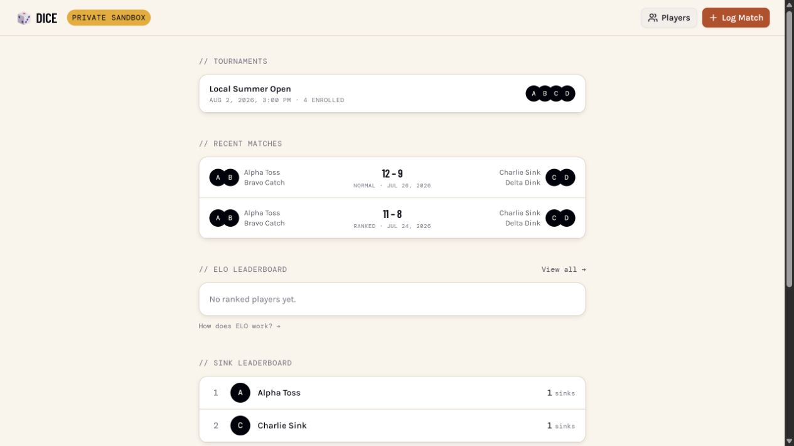
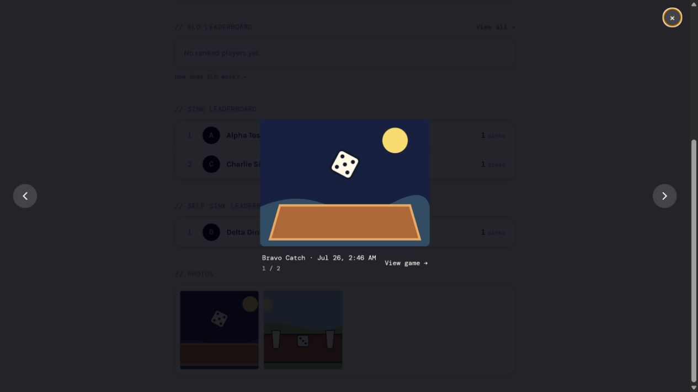
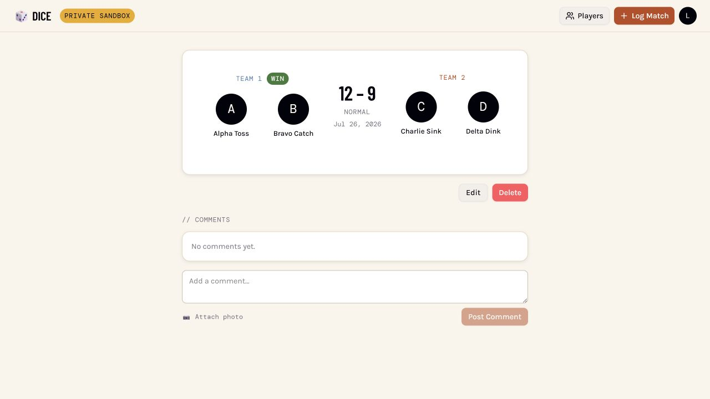

# Dice development sandbox

The Dice sandbox is a disposable, synthetic copy of the parts of production
needed to develop and review Dice. It is the safe default for humans and agents.
Its developer commands support Ubuntu (including WSL2 and Codespaces) and
macOS. Shared scripts must avoid Linux-only interfaces and remain parseable by
Bash 3.2, the conservative macOS compatibility baseline documented in
`AGENTS.md`.
It supports two ways of working without maintaining two harnesses:

- Local: services run on loopback and the browser opens
  `http://localhost:8080/dice`.
- Codespaces: the same services run inside one private Codespace and the browser
  opens the GitHub-generated HTTPS URL for port 8080.

Each Codespace has its own Docker daemon, Postgres database, migrations, and
fixtures. Simultaneous PRs therefore cannot contaminate one another or
production. No VPS, DNS record, deployment secret, or production credential is
required.





The manual private Codespace canary also signed in as the synthetic referee,
created an unranked 12–9 match, and reopened its detail page:



## Start locally

Prerequisites are Docker, PostgreSQL's `psql`, Node.js, and Python 3.12.

```bash
scripts/dice-dev.sh setup
scripts/dice-dev.sh local
```

In a second terminal:

```bash
scripts/dice-dev.sh status
```

`setup` installs locked dependencies, starts local Supabase, applies the Dice
migrations, and loads synthetic fixtures.

## Run the regression suite

Use one entry point instead of reconstructing the known bug-bash journeys by
hand:

```bash
scripts/test-dice-regressions.sh source
```

`source` runs the migration preflight, every Dice backend test, and every Dice
frontend test. When local Supabase is ready, the database-backed transaction
tests run against its exact loopback URL; an ambient or hosted `DB_URL` is never
used.

After this checkout starts and owns the browser-QA stack, exercise the real API
with short, normal, continued-ready, and long/deuce histories:

```bash
scripts/test-dice-regressions.sh sandbox
```

Use `all` to run both phases. The sandbox phase leaves its uniquely identified
synthetic games available for browser inspection and refuses to use processes
owned by another checkout.

## Recreate completed-game scenarios

Use the owned browser-QA lifecycle when a reproduction needs a durable game URL
and API assertions before clicking through the UI:

```bash
scripts/dice-browser-qa.sh start
scripts/dice-browser-qa.sh scenario
```

`scenario` creates a synthetic completed 4–5 unranked 2v2 game, temporarily
ranks it, verifies individual ELO snapshots and both exact-duo replay counts,
unranks it again, and prints the live referee URL. The game is deliberately left
completed and unranked so a tester can reproduce the production flow by checking
**Ranked (affects ELO)** without reopening it, then clicking **Reload**.

Vary the score and rules to exercise short, long, and deuce histories:

```bash
scripts/dice-browser-qa.sh scenario --score 1-0 --target 1
scripts/dice-browser-qa.sh scenario --score 5-0
scripts/dice-browser-qa.sh scenario --score 6-5 --target 5 --win-by 1
scripts/dice-browser-qa.sh scenario --score 25-23 --target 5 --win-by 2
```

`ready_to_finish` is deliberately nonterminal: referees may keep recording
before explicitly finishing, including through another tie. The 6–5 example
recreates that continuation path after the score first became ready at 5–4.

The lifecycle refuses to create a scenario unless this checkout owns both app
processes. This prevents a browser from silently combining one checkout's
frontend with another checkout's backend. Direct frontend launches may override
`VITE_API_URL`, but only with an explicit loopback HTTP URL and port.
When the default ports are already owned, choose explicit alternatives for the
whole lifecycle:

```bash
export DICE_QA_BACKEND_PORT=8002
export DICE_QA_FRONTEND_PORT=8082
scripts/dice-browser-qa.sh start
scripts/test-dice-regressions.sh sandbox
```

## Start in GitHub Codespaces

1. Open the PR branch in a new Codespace.
2. Wait for the repository's post-create command and background sandbox startup
   to finish.
3. Open the notification for the `Private Dice sandbox` port, then visit
   `/dice`.

If the preview is not ready, inspect `/tmp/dice-codespace.log` from the
Codespace terminal or with `gh codespace ssh`. A stopped Codespace restarts the
synthetic harness automatically when it resumes.

From an Ubuntu or macOS checkout with GitHub CLI Codespaces access, wake an
existing workspace, wait for both app services, and print its current URLs:

```bash
scripts/dice-codespace-url.sh <codespace-name>
```

Share the printed `Mobile GitHub sign-in` URL with mobile testers. The ordinary
private-port URL starts with an empty redirect that some in-app mobile browsers
misinterpret as a zero-byte download. The script resolves that redirect to
GitHub's HTML sign-in endpoint without making port 8080 public. Generate a new
link for each testing handoff; the sign-in URL is tied to the running Codespace
session.

Port 8080 is explicitly configured as private. Do not change its visibility.
The devcontainer ignores automatic forwarding for every other port. The browser
reaches only the Dice API and required Supabase paths through the Vite
same-origin gateway, so internal services do not need public URLs or permissive
CORS.

One-time account authorization may be required before creating the first
Codespace:

```bash
gh auth refresh -s codespace
```

That approval belongs to the signed-in developer. Repository code and agents
cannot grant the OAuth scope themselves.

## Isolation contract

The harness deliberately fails closed:

- The reset script requires `--local` semantics and an exact local Postgres URL.
- The backend ignores dotenv overrides, accepts only the local Supabase URL, and
  disables scheduled jobs while `DICE_LOCAL_HARNESS=true`. Its launcher also
  drops ambient Codespaces secrets and binds it to loopback.
- The frontend accepts synthetic credentials only on exact loopback origins or
  the current GitHub Codespaces origin.
- The Codespaces gateway applies `connect-src 'self'` and exposes only Dice API,
  health, and required local Supabase routes.
- Codespaces production-mode builds are rejected.
- Fixtures contain synthetic users and images only.

New Dice schema changes belong in a checked-in `*_dice_*.sql` migration. Add
synthetic data to the fixture migration when a UI or API path needs it. Do not
copy production rows, tokens, or service-role keys into the harness.

## Reset and troubleshooting

```bash
scripts/dice-dev.sh reset
scripts/dice-dev.sh status
scripts/dice-dev.sh stop
```

If setup fails, confirm Docker is running and ports 54321–54327, 8000, and 8080
are unused inside the local machine or Codespace. Re-run `setup`; it is designed
to rebuild the synthetic database deterministically.

Use the failure symptom to recover without weakening an isolation guard:

| Symptom | Likely cause | Recovery |
| --- | --- | --- |
| `scripts/dice-supabase.sh: Permission denied` in CI, but it runs locally | The executable bit exists on the local filesystem but was committed as mode `100644`; `core.filemode=false` can hide this | Run `git update-index --chmod=+x scripts/dice-supabase.sh`, confirm `git ls-files -s scripts/dice-supabase.sh` reports `100755`, commit the mode change, and rerun from a clean checkout |
| Devcontainer construction spends several minutes compiling Python | The Python devcontainer feature was reintroduced | Keep Python 3.12 from Ubuntu 24.04's `python3` and `python3-venv` packages in `.devcontainer/Dockerfile`; do not add the Python feature |
| Devcontainer creation reports that the remote user does not exist | `remoteUser` was changed to a GitHub product name rather than an image user | Keep `remoteUser` set to `vscode`, which exists in the pinned base image |
| Post-create fails with a broken interpreter, missing pip, or an unusable backend virtualenv | A host-created `backend/.venv` was reused through the workspace bind mount | Keep `BACKEND_VENV_DIR=/home/vscode/.cache/dummi/backend-venv`, rebuild the container, and let `backend/start-local-python.sh --setup-only` recreate it using `python -m pip` |
| First runtime startup reinstalls every Python package after `setup` already completed | The secret-scrubbing backend launcher dropped `BACKEND_VENV_DIR` and fell back to the bind-mounted `backend/.venv` | Preserve the absolute external virtualenv path as an explicit non-secret allowlist entry; do not pass the rest of the ambient environment through |
| Devcontainer CLI mounts a Windows checkout or cannot find Linux paths | PowerShell expanded `$PWD` or another shell variable before WSL received the command | Enter Ubuntu/WSL first, `cd` to the Linux checkout, and run the devcontainer command from that shell |
| `Missing or invalid GitHub Codespaces host metadata` | `codespace` was run outside a real Codespace or its GitHub-provided environment was replaced | Use `local` outside Codespaces. Inside Codespaces, preserve `CODESPACES`, `CODESPACE_NAME`, and `GITHUB_CODESPACES_PORT_FORWARDING_DOMAIN`; do not invent a host |
| A private preview link downloads a zero-byte file on mobile | The in-app browser treated GitHub's empty private-port redirect as a download, or the Codespace is stopped | Run `scripts/dice-codespace-url.sh <codespace-name>` from Ubuntu or macOS and open the fresh `Mobile GitHub sign-in` URL in the system browser |
| The browser receives HTTP 403 from Vite | The request Host is neither exact loopback nor the current Codespaces hostname | Use `http://localhost:8080` locally or GitHub's forwarded private URL. Do not set `allowedHosts: true` |
| Harness startup refuses the Supabase URL or production mode | Ambient or production configuration reached a fail-closed boundary | Stop and inspect the invocation. Use `scripts/dice-dev.sh setup` and `local`/`codespace`; do not override the URL, key, or harness marker |
| `status` never becomes ready | A service failed during startup or a required port is occupied | Read the captured harness log, check the exact ports, run `scripts/dice-dev.sh stop`, and retry `setup`. Do not broadly kill unrelated Docker containers or processes |

For a clean-room reproduction, follow the ordered checklist in `AGENTS.md`.

Production-connected development remains an explicit human-only escape hatch:

```bash
DICE_ALLOW_PRODUCTION=1 scripts/dice-dev.sh production
```

It uses real accounts and may mutate real data. It is prohibited inside
Codespaces, and agents must not run it elsewhere unless the user explicitly
requests production-connected testing.

These checks prevent accidental configuration crossover; they are not a
network sandbox against a deliberately malicious process with terminal or root
access. Do not grant production repository secrets to PR Codespaces.
